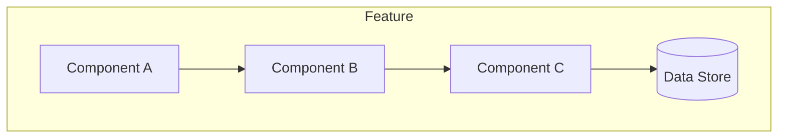
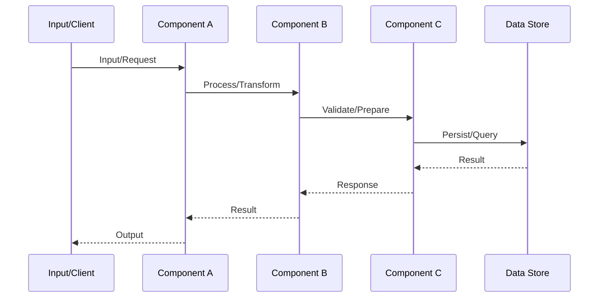

# [Feature Name]

## Overview

Brief description of what this feature implements.

## Language Stack

**IMPORTANT:** Agents MUST identify languages used in this feature and read corresponding skills BEFORE implementation.

### Languages for This Feature

| Language | Purpose | Skill Location |
|----------|---------|----------------|
| [e.g., Rust] | [e.g., HTTP client implementation] | `.agents/skills/rust-clean-code/skill.md` |

**If a skill for a language doesn't exist:**
1. **STOP** - do not write code
2. Launch agent to generate the missing language skill
3. Read the generated skill completely
4. Add this reminder to the workflow for future agents

### Pre-Implementation Checklist

- [ ] Identified all languages used in this feature
- [ ] Read language skill for each language (`.agents/skills/[language]-clean-code/skill.md`)
- [ ] Understood all coding standards and requirements
- [ ] Noted tools and formatters required (rustfmt, black, prettier, etc.)
- [ ] Noted linters required (clippy, ruff, eslint, etc.)

---

## Requirements

1. **Requirement 1**
   - Detail
   - Detail

2. **Requirement 2**
   - Detail

## Architecture (COMPREHENSIVE)

**CRITICAL:** This file contains ALL architecture details for this feature. Do NOT create separate architecture.md, design.md, or technical-spec.md files. All technical decisions belong here.

**Use Mermaid diagrams** to visualize architecture, data flow, and processes.

### Technical Approach

Describe the technical approach and patterns used:
- Pattern 1: Description
- Pattern 2: Description

### Component Structure

**Feature Architecture:**


**File Structure:**
```
[path/to/feature]
├── file1.ext - Purpose
├── file2.ext - Purpose
└── file3.ext - Purpose
```

### Component Details

1. **ComponentName**
   - **Purpose**: What this component does
   - **Location**: `path/to/component.ext`
   - **Interfaces**: Public APIs exposed
   - **Dependencies**: What this component depends on
   - **Key Methods/Functions**: Main functionality

2. **ComponentName**
   - **Purpose**: What this component does
   - **Location**: `path/to/component.ext`

### Data Flow

**Feature Data Flow:**


Describe key data flows through this feature:
1. Input received at [point A]
2. Processed by [component B]
3. Output sent to [point C]

### Interface Definitions

**Public APIs:**
```rust/typescript/python
# Define key interfaces, types, or function signatures
```

**Internal Contracts:**
- Component A provides X to Component B
- Component B expects Y interface

### Error Handling Strategy

Describe how errors are handled:
- Error types defined
- Propagation strategy
- Recovery mechanisms

### Security Considerations

- [Security concern 1 and mitigation]
- [Security concern 2 and mitigation]

### Performance Considerations

- [Performance concern 1 and optimization]
- [Performance concern 2 and optimization]

### Trade-offs and Decisions

| Decision | Rationale | Alternatives Considered |
|----------|-----------|------------------------|
| Technical decision 1 | Why this approach | What was rejected |
| Technical decision 2 | Why this approach | What was rejected |

## Implementation

### Files to Create/Modify

- `path/to/file.ext` - Description
- `path/to/test.ext` - Test file

## Tasks

- [ ] Task 1: Description
- [ ] Task 2: Description
- [ ] Task 3: Description

## Testing

### Test Cases

1. **Test Case 1**
   - Given: Initial state
   - When: Action
   - Then: Expected result

2. **Test Case 2**
   - Given: Initial state
   - When: Action
   - Then: Expected result

## Success Criteria

- [ ] All tasks completed
- [ ] All tests passing
- [ ] Verification checks pass
- [ ] No TODO/FIXME/stubs

---

_Created: YYYY-MM-DD_
