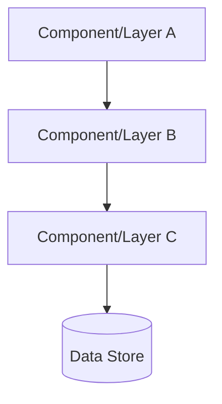
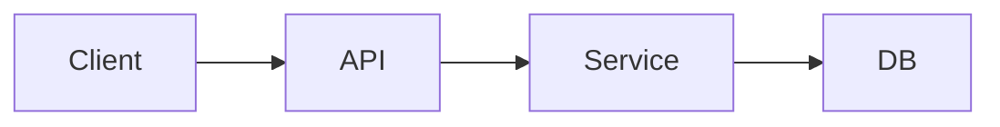
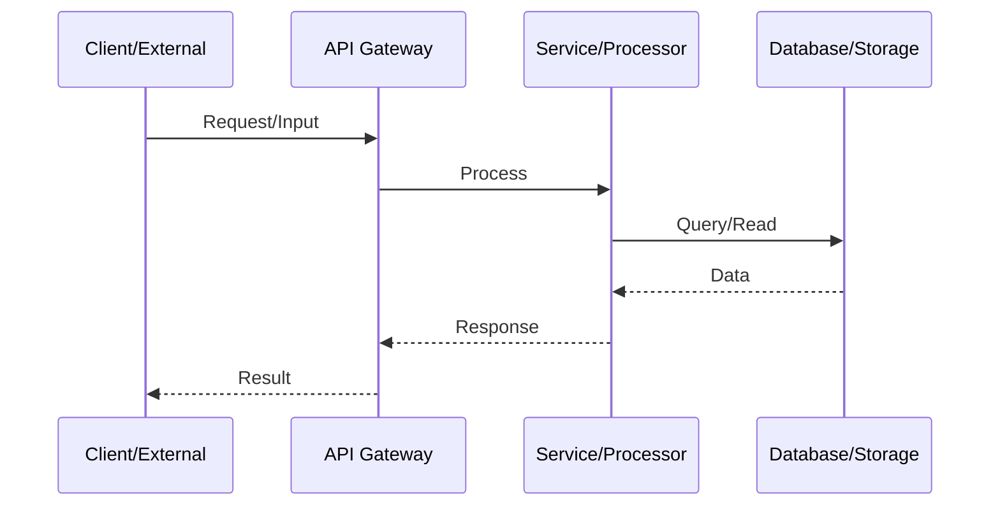

# Overview

Brief description of what this specification implements and why.

## Goals

- Goal 1: Description
- Goal 2: Description
- Goal 3: Description

## Implementation Location

- Primary implementation: `[path/to/implementation]`
- Feature specifications: `specifications/[NN-spec-name]/features/*/feature.md`
- Documentation: `documentation/[module]/doc.md`

## Known Issues

None currently identified.

## Language Stack

**IMPORTANT:** Agents MUST identify the language stack below and read the corresponding skills BEFORE implementation.

### Languages Used

| Language | Purpose | Skill Location |
|----------|---------|----------------|
| [e.g., Rust] | [e.g., Backend API implementation] | `.agents/skills/rust-clean-code/skill.md` |
| [e.g., Python] | [e.g., Data processing services] | `.agents/skills/python-clean-code/skill.md` |

### Mandatory Pre-Implementation Steps

1. **Identify languages** from this section
2. **Read language skills** - for each language:
   - Locate skill at `.agents/skills/[language]-clean-code/skill.md`
   - If skill exists: read it completely before writing any code
   - If skill missing: **STOP** - launch agent to generate the skill first, then read it
3. **Document skills** - add this item to any start.md workflow so future agents remember
4. **Follow standards strictly** - zero tolerance for deviations from documented standards

### Language-Specific Requirements

**[Language 1] Requirements:**
- [Requirement 1: e.g., Run formatter before commit]
- [Requirement 2: e.g., Zero linter warnings]
- [Requirement 3: e.g., All public items documented]

**[Language 2] Requirements:**
- [Requirement 1]
- [Requirement 2]

---

## Feature Index

The implementation is divided into features with clear dependencies. Each feature contains detailed requirements, tasks, and verification steps in its respective `feature.md` file.

**Implementation Guidelines:**
- Implement features in dependency order
- Each feature contains complete requirements and tasks
- Refer to individual feature.md files for detailed specifications

| #  | Feature | Description | Dependencies | Status |
|----|---------|-------------|--------------|--------|
| 0  | [feature-name](./features/feature-name/feature.md) | Brief description | None | ⬜ Pending |
| 1  | [another-feature](./features/another-feature/feature.md) | Brief description | 0 | ⬜ Pending |

Status Key: ⬜ Pending | 🔄 In Progress | ✅ Complete

## Requirements Conversation Summary

This specification was created through collaborative requirements gathering with the user, focusing on:
- Key decision 1
- Key decision 2
- Key decision 3

## High-Level Architecture

**CRITICAL:** This section contains the complete architectural specification. Do NOT create separate architecture.md files. All technical decisions, component descriptions, and design rationale belong here or in feature.md files.

**Use Mermaid diagrams** to visualize architecture and processes for clarity.

### Architecture Overview

**System Architecture:**

1. **Layer/Component 1**: Description of purpose and responsibilities
2. **Layer/Component 2**: Description of purpose and responsibilities
3. **Layer/Component 3**: Description of purpose and responsibilities

### Component Relationships

**Component Interaction:**

Describe how components interact:
- Component A → Component B: [interaction description]
- Component B → Component C: [interaction description]

### Data Flow

**Request/Process Flow:**

Describe key data flows through the system:
1. [Flow 1 description]
2. [Flow 2 description]

### Technical Decisions and Trade-offs

| Decision | Rationale | Alternatives Considered |
|----------|-----------|------------------------|
| Decision 1 | Why this approach | What was rejected and why |
| Decision 2 | Why this approach | What was rejected and why |

### Implementation Order

Each layer/component is implemented as a separate feature with clear dependencies (see Feature Index).

# Success Criteria (Spec-Wide)

This specification is considered complete when:

## Functionality
- All features completed and verified (see Feature Index)
- [Specific functional requirement 1]
- [Specific functional requirement 2]

## Code Quality
- Zero warnings from linting tools
- Code formatting passes
- All unit and integration tests pass
- End-to-end integration tests demonstrate full feature interoperability

## Documentation
- Module documentation updated
- `LEARNINGS.md` captures design decisions and trade-offs
- `VERIFICATION.md` produced with all verification checks passing
- `REPORT.md` created documenting final implementation

## Module References

Agents implementing features should read these documentation files:
- `documentation/[module]/doc.md` - Module patterns and conventions

---

_Created: YYYY-MM-DD_
_Last Updated: YYYY-MM-DD_
_Structure: Feature-based (has_features: true)_
